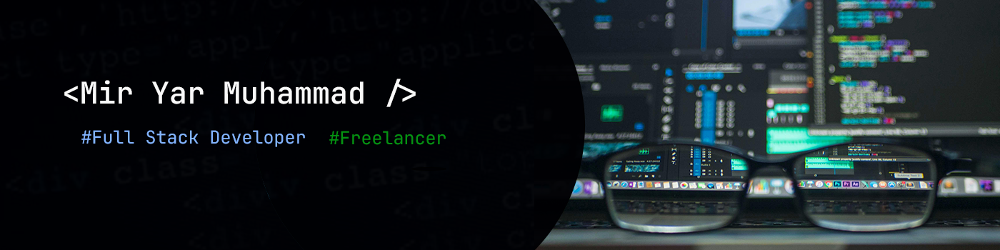

## 🤖 Mir Yar Muhammad

**`🧑🏻‍💻Full Stack Web Developer / 🎬Content Creater`**

👉As a seasoned full-stack web developer, I excel in crafting sophisticated websites, intuitive dashboards, and robust content management systems (CMS), particularly WordPress With deep proficiency in both front-end and back-end technologies, I specialize in leveraging ⚛️ React and 🌐 Node.js to create highly customized and seamlessly integrated digital solutions. My portfolio includes a strong emphasis on e-commerce platforms and real estate websites, where I deliver responsive, engaging, and user-centric experiences. My comprehensive approach ensures that every project is tailored to meet the unique needs of clients, driving their digital success with innovative and reliable web solutions.

---

### 🛠️ Languages and Tools

 
---

## 

